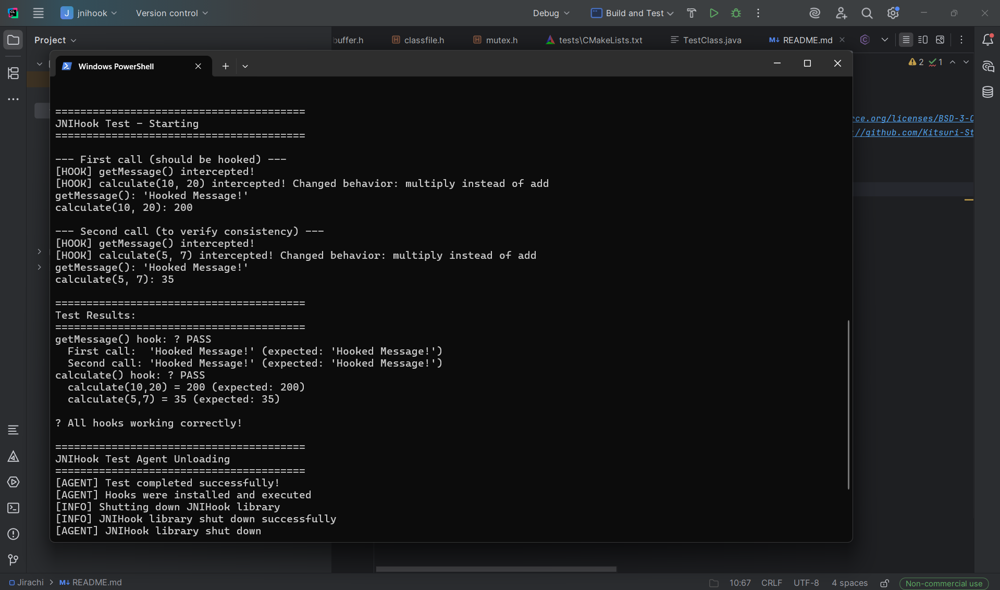

# Jirachi

 An General Purpose Cross Platform Java Native Interface hook library Written in Pure C

[](https://opensource.org/licenses/BSD-3-Clause)
[ ](https://github.com/Kitsuri-Studios/Jirachi/issues)[](https://github.com/Kitsuri-Studios/Jirachi/stargazers)

# Preview



> [!IMPORTANT]
>
> **Android Runtime Limitations**
>
> This project does **not** use standard Android JVMTI.
> Android relies on a custom runtime implementation known as **ART TI**.
>
> - **ART TI support is limited to SDK 26 (Android 8.0) and above**
> - The native library **must be loaded as an agent before the Application context is created**
> - This requires **early initialization** (e.g. via a `ContentProvider`)
> - Agent loading depends on **Android SDK internals (`Debug.java`)**
>
> **Android compatibility is currently broken**
>
> - The project is **not functional on Android at this time**
> - A proper **Android binding has not yet been implemented**
> - Android support will be added in a **future release**
>
> This behavior is **undocumented**, **unsupported**, and may break across
> Android versions, OEM ROMs, or security updates.


---

## Building the Project

This project uses **CMake** and supports **Windows, Linux, and macOS**.
Android builds are not supported.

---

### Requirements

* CMake 3.12 or newer
* A C compiler

    * Windows: MSVC or MinGW
    * Linux/macOS: GCC or Clang
* Java Development Kit (JDK)
* `JAVA_HOME` environment variable pointing to a valid JDK installation

---

### Verify Prerequisites

```bash
cmake --version
javac -version
```

---

## Step 1: Configure `JAVA_HOME`

### Windows (PowerShell)

```powershell
$env:JAVA_HOME="C:\Program Files\Java\jdk-23"
```

### Linux / macOS

```bash
export JAVA_HOME=/path/to/jdk
```

`JAVA_HOME` must reference a full JDK, not a JRE.

---

## Step 2: Configure the Build

From the project root directory, run:

```bash
cmake -S . -B build \
  -DCMAKE_BUILD_TYPE=Release \
  -DJNIHOOK_BUILD_SHARED=ON \
  -DJNIHOOK_BUILD_STATIC=ON \
  -DJNIHOOK_BUILD_TESTS=OFF
```

This step:

* Detects the host platform
* Locates JNI headers using `JAVA_HOME`
* Generates build files in the `build` directory

---

## Step 3: Build the Project

```bash
cmake --build build
```

For parallel builds:

```bash
cmake --build build -j
```

---

## Build Outputs

After a successful build, the following artifacts are produced:

| Platform | Output Files                                       |
| -------- | -------------------------------------------------- |
| Windows  | `jnihook.dll`, `jnihook.lib`, `jnihook_static.lib` |
| Linux    | `libjnihook.so`, `libjnihook.a`                    |
| macOS    | `libjnihook.dylib`, `libjnihook.a`                 |

All outputs are located in the `build` directory.

---

## Optional: Build with Tests

```bash
cmake -S . -B build \
  -DJNIHOOK_BUILD_TESTS=ON \
  -DJNIHOOK_RUN_TESTS_AUTO=ON

cmake --build build
```

When enabled, tests are executed automatically after the build completes.

---

## Optional: Install

```bash
cmake --build build --target install
```

This installs:

* Header files to `include/jnihook`
* Libraries to `lib`
* CMake package configuration to `lib/cmake/jnihook`

---

## CLion Usage

1. Clone the repository:

   ```bash
   git clone https://github.com/Kitsuri-Studios/Jirachi
   ```
2. Open CLion
3. Select **Open** and choose the project root directory
4. CLion will automatically:

    * Detect the `CMakeLists.txt`
    * Configure the project
    * Generate build files
5. Use the **Build** or **Run** actions to compile the project

Ensure `JAVA_HOME` is set before launching CLion.

---


## Disclaimer
This library is created **strictly for research purposes**. Any harm caused by its use is **not the responsibility of the authors**. It is **strongly recommended** not to use this library for any illegal or pirated activities.

## License
This project is licensed under **BSD 3-Clause License**.  
**Summary:** You are free to use, modify, and distribute the code, but you cannot use the names of the authors for promotion, and there is **no warranty**.
